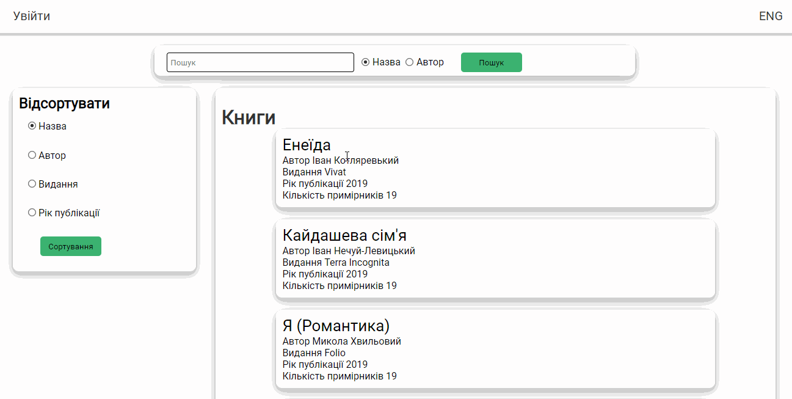
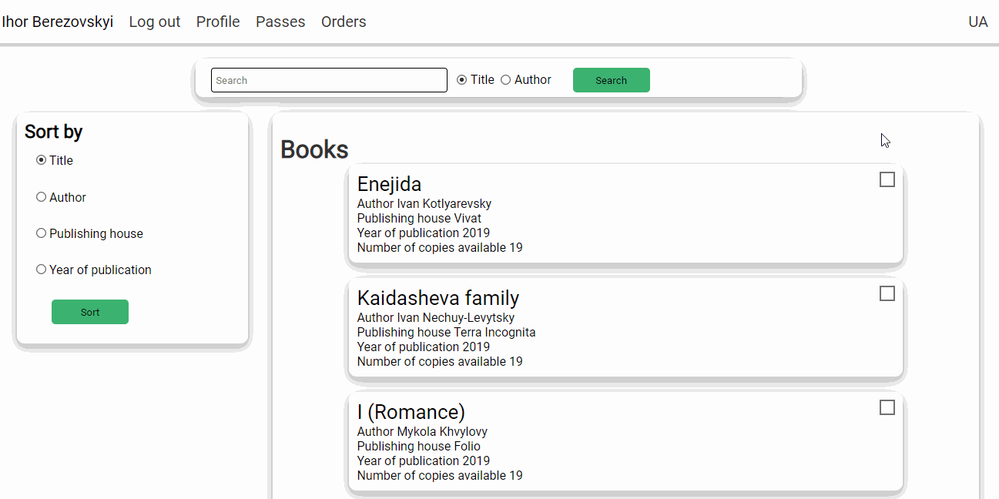
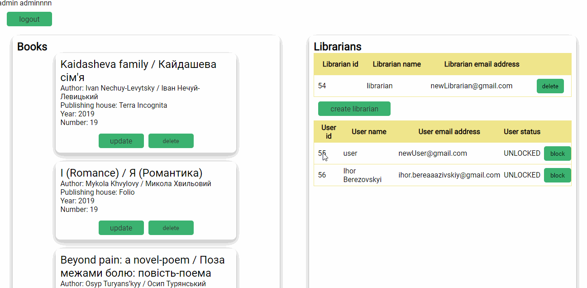
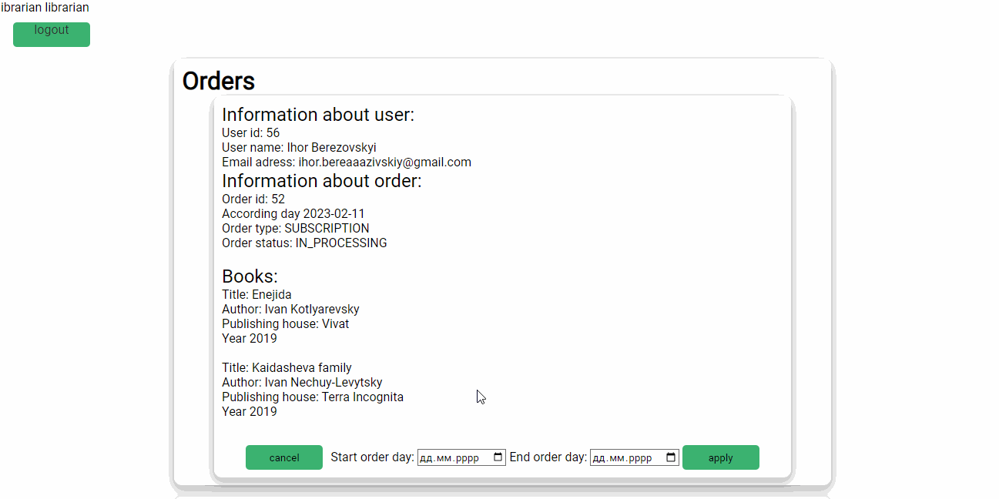

<h1 align="center">OnlineLibrary</h1>

## Description

**Library. The system is designed to monitor and manage the activities of customers, staff and library owners.**

* The reader registers in the system and then has the opportunity to:
- search (by author/title);
- order a book from the catalog.
* An unregistered Reader cannot order a book.
*  For the catalog, implement the ability to sort books:
- by name;
- by author;
- by edition;
- by the date of publication.
* The librarian issues a book to the reader for subscription or to the reading room.
* The book is issued to the Reader for a certain period. If the book is not returned within the specified time, the
  reader will be charged a fine.
* The book can be present in the library in one or more copies. The system keeps track of the available number of books.
* Each user has a personal account in which registration information is displayed, as well as

1) for the reader:

- a list of books that are on the subscription and the date of possible return (if the date is overdue, the amount of
  the fine is displayed);

2) for the librarian:

- list of readers' orders;
- list of readers and their subscriptions.
  The system administrator has the following rights:
- adding/deleting a book, editing information about a book;
- creating/deleting a librarian;
- blocking / unblocking the user.

## About the project

- **Database:** MySQL.
- **Tools:** Maven, IntelliJ, Workbench, Apache Tomcat.
- **Technologies:** Java Servlet API, HTML, CSS, JDBC, Junit, JSP, Log4j.

- To access the data, used connection pool.
- Provided the application with support to work with the Cyrillic alphabet (be multilingual), including when storing
  information in the database: it is possible to switch the interface language;
- There is support for input, output and storage of information (in the database), recorded in different languages;
- Chose at least two languages: one based on Cyrillic (Ukrainian), another based on Latin (English).
- The application architecture conformed to the MVC template.
- When implementing business logic, used design patterns:Factory, Singleton etc.
- Using servlets and JSP, implemented the functionality -described in the functional requirements.
- Used Apache Tomcat as a servlet container.
- Used JSTL library tags and custom tags (minimum: one) on JSP pages custom tag library tag and one tag file tag).
- Implemented protection against re-sending data to the server when refreshing the page (implement PRG).
- Used sessions, filters, listeners when developing.
- Authentication and authorization, delimitation of access rights of system users to program components implemented in
  the application. Password encryption is done.
- Introduced an event log into the project using the log4j library.
- The code contains comments on the documentation (all top-level classes, non-trivial methods and designers).
- The application is covered by modular tests (minimum coverage percentage of 40%).
- Implemented the mechanism of pagination of data pages.
- All input fields use data validation.
- The application respond correctly to errors and exceptions of various kinds (final user should not see the stack trace
  on the client side).
- Used HTML, CSS.

## User interface

## Admin interface

## Librarian interface

